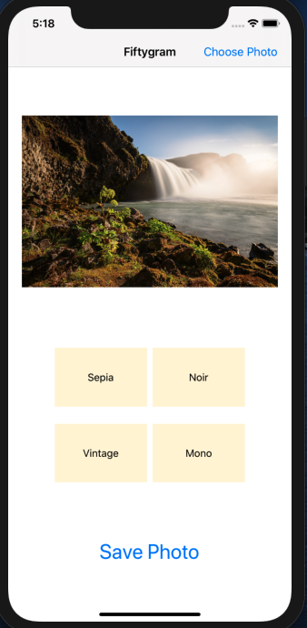

# Fiftygram iOS App
- Allows users to apply different filters to their photos and save them
- Written in Swift 

<b>Functionalities</b> 
- Original photo  
 

- Applied Noir filter 

- Applied Vintage filter 
 

- Saved photo 
 
